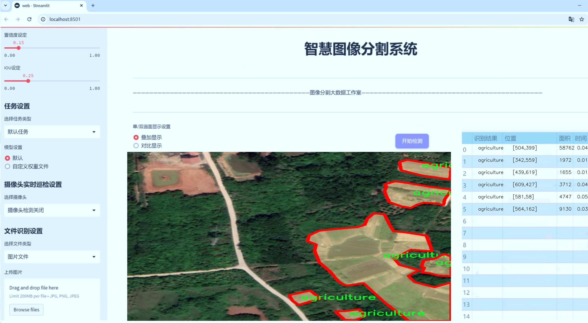
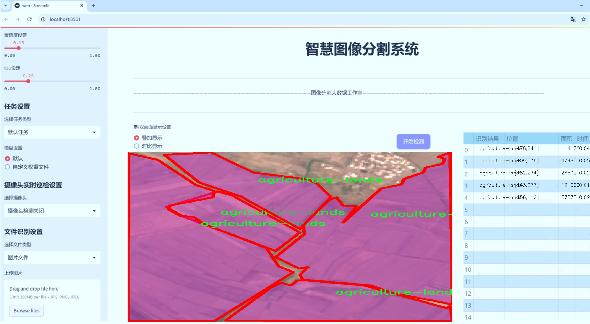
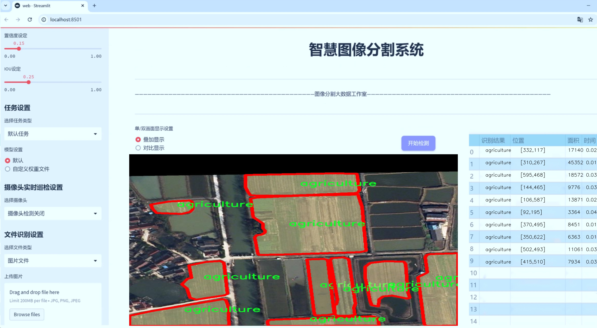
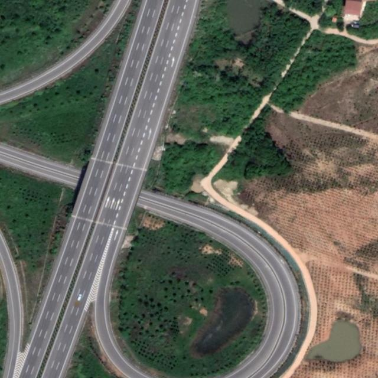
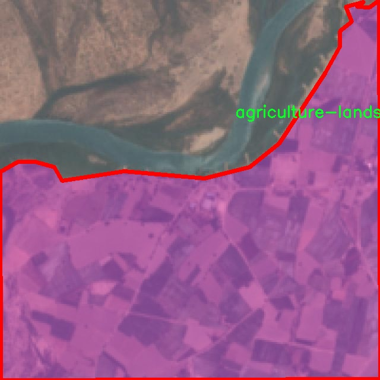
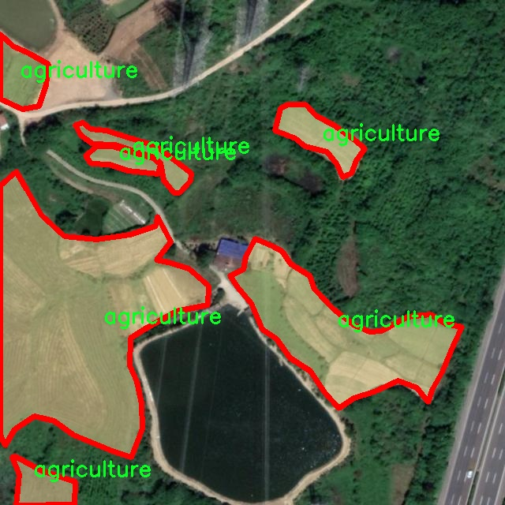
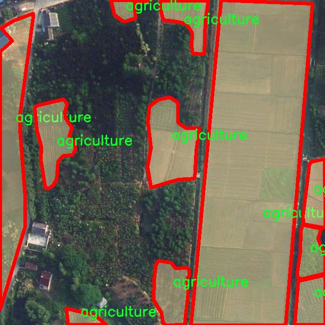

# 航拍图农业场景与道路图像分割系统源码＆数据集分享
 [yolov8-seg-C2f-EMBC＆yolov8-seg-LSKNet等50+全套改进创新点发刊_一键训练教程_Web前端展示]

### 1.研究背景与意义

项目参考[ILSVRC ImageNet Large Scale Visual Recognition Challenge](https://gitee.com/YOLOv8_YOLOv11_Segmentation_Studio/projects)

项目来源[AAAI Global Al lnnovation Contest](https://kdocs.cn/l/cszuIiCKVNis)

研究背景与意义

随着全球人口的持续增长和城市化进程的加快，农业生产面临着前所未有的挑战。如何提高农业生产效率、优化资源配置、实现可持续发展，已成为各国政府和科研机构亟待解决的重要课题。在这一背景下，遥感技术和计算机视觉的快速发展为农业管理和监测提供了新的解决方案。尤其是航拍图像的获取和处理，为农业场景的分析提供了丰富的数据来源，进而推动了精准农业的发展。

近年来，深度学习技术在图像分割领域取得了显著进展，尤其是YOLO（You Only Look Once）系列模型因其高效的实时处理能力和良好的检测精度而受到广泛关注。YOLOv8作为该系列的最新版本，进一步提升了模型的性能，尤其在复杂场景下的目标检测和分割任务中表现出色。然而，传统的YOLOv8模型在处理特定领域的图像时，尤其是农业场景与道路图像的分割任务时，仍然存在一定的局限性。因此，基于改进YOLOv8的航拍图农业场景与道路图像分割系统的研究具有重要的理论和实践意义。

本研究所使用的数据集包含1200幅图像，涵盖了农业、城市、森林、河流等六个类别，能够为模型的训练和测试提供丰富的样本。这些类别不仅反映了不同的地理特征，还体现了农业与城市环境的交互关系。通过对这些图像的有效分割与分析，可以深入理解农业用地的分布情况、作物生长状况以及城市化对农业的影响。这为政策制定者提供了重要的决策依据，有助于实现科学的土地利用规划和农业资源的合理配置。

此外，改进YOLOv8模型的研究将为图像分割技术在农业领域的应用提供新的思路。通过优化模型结构、增强特征提取能力和提高分割精度，能够更好地适应复杂的农业场景，进而提升农业监测的准确性和效率。这不仅能够为农民提供及时的作物生长信息，还能帮助农业管理部门进行有效的资源调配和环境监测，推动农业的可持续发展。

综上所述，基于改进YOLOv8的航拍图农业场景与道路图像分割系统的研究，不仅具有重要的学术价值，也具有广泛的应用前景。通过对农业场景与道路图像的精确分割，可以为农业生产提供科学依据，推动农业现代化进程，同时也为相关领域的研究提供了新的数据支持和技术参考。这一研究的开展，将为实现精准农业、促进生态平衡和可持续发展做出积极贡献。

### 2.图片演示







##### 注意：由于此博客编辑较早，上面“2.图片演示”和“3.视频演示”展示的系统图片或者视频可能为老版本，新版本在老版本的基础上升级如下：（实际效果以升级的新版本为准）

  （1）适配了YOLOV8的“目标检测”模型和“实例分割”模型，通过加载相应的权重（.pt）文件即可自适应加载模型。

  （2）支持“图片识别”、“视频识别”、“摄像头实时识别”三种识别模式。

  （3）支持“图片识别”、“视频识别”、“摄像头实时识别”三种识别结果保存导出，解决手动导出（容易卡顿出现爆内存）存在的问题，识别完自动保存结果并导出到tempDir中。

  （4）支持Web前端系统中的标题、背景图等自定义修改，后面提供修改教程。

  另外本项目提供训练的数据集和训练教程,暂不提供权重文件（best.pt）,需要您按照教程进行训练后实现图片演示和Web前端界面演示的效果。

### 3.视频演示

[3.1 视频演示](https://www.bilibili.com/video/BV1YayhYtEF7/)

### 4.数据集信息展示

##### 4.1 本项目数据集详细数据（类别数＆类别名）

nc: 6
names: ['Agriculture', 'City', 'Forest', 'River', 'agriculture', 'agriculture-lands']


##### 4.2 本项目数据集信息介绍

数据集信息展示

在现代农业与城市规划的交汇点上，航拍图像的分析与处理正变得愈发重要。为此，我们构建了一个名为“agriculture and road seg”的数据集，旨在为改进YOLOv8-seg的航拍图农业场景与道路图像分割系统提供丰富的训练素材。该数据集包含六个主要类别，分别为农业、城市、森林、河流、农业（重复类别）以及农业用地。这些类别的选择不仅反映了农业与城市环境的多样性，也为模型的训练提供了广泛的应用场景。

在数据集的构建过程中，我们精心挑选了来自不同地理区域的航拍图像，以确保数据的多样性和代表性。每个类别的图像均经过严格的标注，确保在训练过程中，模型能够准确地识别和分割不同的地物特征。例如，农业类别包含了各种农作物的生长状态和不同种植方式的图像，而城市类别则展示了城市基础设施、建筑物和交通网络的复杂性。森林和河流类别则为模型提供了自然环境的特征，帮助其理解生态系统的组成。

数据集中的“农业”类别和“农业用地”类别虽然名称相似，但它们的标注内容却各有侧重。前者主要关注农作物的生长状态和种植区域，而后者则强调土地的利用情况和分布特征。这种细致的分类有助于模型在实际应用中更好地理解土地利用的变化，从而为农业管理和城市规划提供数据支持。

在图像采集方面，我们采用了高分辨率的航拍技术，确保每张图像都能清晰地展现地物特征。数据集中的图像不仅涵盖了不同的季节和天气条件，还包括了不同的时间段，以增强模型的鲁棒性和适应性。这种多样化的图像来源使得模型在面对真实世界中的复杂场景时，能够更好地进行分割和识别。

此外，为了提高数据集的实用性，我们还对图像进行了预处理，包括图像增强、噪声去除和对比度调整等。这些处理步骤旨在提升图像质量，确保模型在训练过程中能够获得更清晰的特征信息，从而提高分割精度。

“agriculture and road seg”数据集的构建不仅是为了提升YOLOv8-seg模型的性能，更是为了推动农业与城市管理领域的智能化发展。通过精确的图像分割，相关部门可以更好地进行土地利用规划、环境监测和资源管理，从而实现可持续发展目标。

总之，该数据集为航拍图像分析提供了一个全面的基础，涵盖了农业、城市、森林和水体等多个方面。随着技术的不断进步和数据集的持续扩展，我们期待这一研究能够为未来的农业和城市管理提供更为精准的决策支持，推动相关领域的创新与发展。










### 5.全套项目环境部署视频教程（零基础手把手教学）

[5.1 环境部署教程链接（零基础手把手教学）](https://www.bilibili.com/video/BV1jG4Ve4E9t/?vd_source=bc9aec86d164b67a7004b996143742dc)


[5.2 安装Python虚拟环境创建和依赖库安装视频教程链接（零基础手把手教学）](https://www.bilibili.com/video/BV1nA4VeYEze/?vd_source=bc9aec86d164b67a7004b996143742dc)

### 6.手把手YOLOV8-seg训练视频教程（零基础小白有手就能学会）

[6.1 手把手YOLOV8-seg训练视频教程（零基础小白有手就能学会）](https://www.bilibili.com/video/BV1cA4VeYETe/?vd_source=bc9aec86d164b67a7004b996143742dc)


按照上面的训练视频教程链接加载项目提供的数据集，运行train.py即可开始训练



     Epoch   gpu_mem       box       obj       cls    labels  img_size
     1/200     0G   0.01576   0.01955  0.007536        22      1280: 100%|██████████| 849/849 [14:42<00:00,  1.04s/it]
               Class     Images     Labels          P          R     mAP@.5 mAP@.5:.95: 100%|██████████| 213/213 [01:14<00:00,  2.87it/s]
                 all       3395      17314      0.994      0.957      0.0957      0.0843

     Epoch   gpu_mem       box       obj       cls    labels  img_size
     2/200     0G   0.01578   0.01923  0.007006        22      1280: 100%|██████████| 849/849 [14:44<00:00,  1.04s/it]
               Class     Images     Labels          P          R     mAP@.5 mAP@.5:.95: 100%|██████████| 213/213 [01:12<00:00,  2.95it/s]
                 all       3395      17314      0.996      0.956      0.0957      0.0845

     Epoch   gpu_mem       box       obj       cls    labels  img_size
     3/200     0G   0.01561    0.0191  0.006895        27      1280: 100%|██████████| 849/849 [10:56<00:00,  1.29it/s]
               Class     Images     Labels          P          R     mAP@.5 mAP@.5:.95: 100%|███████   | 187/213 [00:52<00:00,  4.04it/s]
                 all       3395      17314      0.996      0.957      0.0957      0.0845


### 7.50+种全套YOLOV8-seg创新点代码加载调参视频教程（一键加载写好的改进模型的配置文件）

[7.1 50+种全套YOLOV8-seg创新点代码加载调参视频教程（一键加载写好的改进模型的配置文件）](https://www.bilibili.com/video/BV1Hw4VePEXv/?vd_source=bc9aec86d164b67a7004b996143742dc)

### 8.YOLOV8-seg图像分割算法原理

原始YOLOv8-seg算法原理

YOLOv8-seg算法是YOLO系列目标检测算法的最新版本之一，结合了目标检测与图像分割的功能，旨在实现更高效、更精确的实时目标识别与分割。该算法在YOLOv5的基础上进行了多项创新和优化，尤其是在网络结构、特征提取、特征融合以及检测头的设计上，展现出显著的性能提升。

首先，YOLOv8-seg的网络结构主要由三个核心部分组成：主干网络（backbone）、特征增强网络（neck）和检测头（head）。在主干网络中，YOLOv8-seg采用了轻量化的C2F模块替代了传统的C3模块。C2F模块通过使用3×3的卷积核和深度可分离卷积，显著降低了计算复杂度，同时保持了特征提取的有效性。这种设计使得YOLOv8-seg能够在嵌入式设备上高效运行，满足实时检测的需求。

在特征增强网络部分，YOLOv8-seg结合了特征金字塔网络（FPN）和路径聚合网络（PAN）的优势，构建了一个更加高效的特征融合结构。特征金字塔网络通过多尺度特征的提取与融合，使得模型能够更好地处理不同尺度的目标，而路径聚合网络则通过优化特征传递路径，增强了特征的表达能力。此外，YOLOv8-seg引入了BiFPN（Bidirectional Feature Pyramid Network），通过高效的双向跨尺度连接和加权特征融合，进一步提升了模型对不同尺度特征信息的提取速度和准确性。

在检测头的设计上，YOLOv8-seg采用了解耦头的结构，这一创新使得分类和回归任务被分离为两个独立的分支。通过解耦，模型能够更加专注于各自的任务，从而有效解决复杂场景下的定位不准和分类错误的问题。这种设计理念不仅提高了检测精度，还增强了模型的灵活性和适应性。

YOLOv8-seg还采用了无锚（Anchor-free）目标检测方法，避免了传统方法中锚框选择和调整的繁琐过程。无锚检测方法通过直接回归目标的位置和大小，使得网络能够更快地聚焦于目标位置的邻近点，显著提高了预测框的准确性。这一创新在处理不同尺度和形状的目标时表现尤为突出，进一步提升了模型的整体性能。

在训练过程中，YOLOv8-seg引入了多尺度训练和测试策略，使得模型能够在不同的输入尺寸下进行训练和评估，从而增强了模型的泛化能力。通过对数据集进行多样化处理，YOLOv8-seg能够更好地适应各种实际应用场景，如智能监控、自动驾驶和人脸识别等。

此外，YOLOv8-seg在损失函数的设计上也进行了优化，采用了更复杂的损失计算方式，以提高模型的训练效果。这种改进使得模型在面对复杂背景和遮挡物时，依然能够保持较高的检测精度和鲁棒性。

总的来说，YOLOv8-seg算法通过一系列创新的设计和优化，显著提升了目标检测与分割的性能。其轻量化的网络结构、高效的特征融合机制以及无锚检测方法，使得YOLOv8-seg在实时性和准确性上均表现出色，成为当前目标检测领域的重要进展。随着YOLOv8-seg的不断发展和应用，预计将为更多实际场景提供强有力的技术支持，推动计算机视觉技术的进一步发展。


### 9.系统功能展示（检测对象为举例，实际内容以本项目数据集为准）

图9.1.系统支持检测结果表格显示

  图9.2.系统支持置信度和IOU阈值手动调节

  图9.3.系统支持自定义加载权重文件best.pt(需要你通过步骤5中训练获得)

  图9.4.系统支持摄像头实时识别

  图9.5.系统支持图片识别

  图9.6.系统支持视频识别

  图9.7.系统支持识别结果文件自动保存

  图9.8.系统支持Excel导出检测结果数据


### 10.50+种全套YOLOV8-seg创新点原理讲解（非科班也可以轻松写刊发刊，V11版本正在科研待更新）

#### 10.1 由于篇幅限制，每个创新点的具体原理讲解就不一一展开，具体见下列网址中的创新点对应子项目的技术原理博客网址【Blog】：


[10.1 50+种全套YOLOV8-seg创新点原理讲解链接](https://gitee.com/qunmasj/good)

#### 10.2 部分改进模块原理讲解(完整的改进原理见上图和技术博客链接)【如果此小节的图加载失败可以通过CSDN或者Github搜索该博客的标题访问原始博客，原始博客图片显示正常】
### YOLOv8简介
Yolov8主要借鉴了Yolov5、Yolov6、YoloX等模型的设计优点，其本身创新点不多，偏重在工程实践上，具体创新如下:
·提供了一个全新的SOTA模型（包括P5 640和P6 1280分辨率的目标检测网络和基于YOLACT的实例分割模型)。并且，基于缩放系数提供了N/S/M/IL/X不同尺度的模型，以满足不同部署平台和应用场景的需求。
●Backbone:同样借鉴了CSP模块思想，不过将Yolov5中的C3模块替换成了C2f模块，实现了进一步轻量化，同时沿用Yolov5中的SPPF模块，并对不同尺度的模型进行精心微调，不再是无脑式—套参数用于所有模型，大幅提升了模型性能。
●Neck:继续使用PAN的思想，但是通过对比YOLOv5与YOLOv8的结构图可以看到，YOLOv8移除了1*1降采样层。
●Head部分相比YOLOv5改动较大，Yolov8换成了目前主流的解耦头结构(Decoupled-Head)，将分类和检测头分离，同时也从Anchor-Based换成了Anchor-Free。
●Loss计算:使用VFLLoss作为分类损失(实际训练中使用BCE Loss);使用DFLLoss+ClOU Loss作为回归损失。
●标签分配: Yolov8抛弃了以往的loU分配或者单边比例的分配方式，而是采用Task-Aligned Assigner正负样本分配策略。
#### Yolov8网络结构
Yolov8模型网络结构图如下图所示。


#### Backbone
Yolov8的Backbone同样借鉴了CSPDarkNet结构网络结构，与Yolov5最大区别是，Yolov8使用C2f模块代替C3模块。具体改进如下:
·第一个卷积层的Kernel size从6×6改为3x3。
·所有的C3模块改为C2f模块，如下图所示，多了更多的跳层连接和额外Split操作。。Block数由C3模块3-6-9-3改为C2f模块的3-6-6-3。

### 上下文引导网络（CGNet）简介


高准确率的模型（蓝点），由图像分类网络转化而来且参数量大，因此大多不适于移动设备。
低分辨率的小模型（红点），遵循分类网络的设计方式，忽略了分割特性，故而效果不好。
#### CGNet的设计：
为了提升准确率，用cgnet探索语义分割的固有属性。对于准确率的提升，因为语义分割是像素级分类和目标定位，所以空间依赖性和上下文信息发挥了重要作用。因此，设计cg模块，用于建模空间依赖性和语义上下文信息。
- 1、cg模块学习局部特征和周围特征形成联合特征
- 2、通过逐通道重新加权（强调有用信息，压缩无用信息），用全局特征改善联合特征
- 3、在全阶段应用cg模块，以便从语义层和空间层捕捉信息。
为了降低参数量：1、深层窄网络，尽可能节约内存 2、用通道卷积


之前的网络根据框架可分三类：
- 1、FCN-shape的模型，遵循分类网络的设计，忽略了上下文信息 ESPNet、ENet、fcn
- 2、FCN-CM模型，在编码阶段后用上下文模块捕捉语义级信息 DPC、DenseASPP、DFN、PSPNet
- 3、（our）在整个阶段捕捉上下文特征
- 4、主流分割网络的下采样为五次，学习了很多关于物体的抽象特征，丢失了很多有鉴别性的空间信息，导致分割边界过于平滑，（our）仅采用三次下采样，利于保存空间信息


#### cg模块

Cg模块：
思路：人类视觉系统依赖上下文信息理解场景。
如图3,a， 如若仅关注黄色框框，很难分辨，也就是说，仅关注局部特征不容易正确识别目标的类别。 然后，如果加入了目标周围的特征，即图3,b，就很容易识别正确，所以周围特征对于语义分割是很有帮助的。在此基础上，如果进一步用整个场景的特征加以辅助，将会有更高的程度去争正确分类黄色框框的物体，如图3,c所示。 故，周围上下文和全局上下文对于提升分割精度都是有帮助的。


实现：基于此，提出cg模块，利用局部特征，周围上下文以及全局上下文。如图3,d所示。该模块共包含两个阶段。

第一步，floc( ) 局部和 fsur( )周围函数分别学习对应特征。floc( )用3x3卷积从周围8个点提取特征，对应于黄色框框；同时fsur( )用感受野更大的3x3带孔卷积学习周围上下文，对应红色框框。然后fjoi( )是指将前两路特征concat之后经BN，PReLU。此一部分是cg模块的第一步。
对于模块的第二步，fglo( )用于提取全局特征，改善联合特征。受SENet启发，全局上下文被认为是一个加权向量，用于逐通道微调联合特征，以强调有用元素、压缩无用元素。在本论文中，fglo( )用GAP产生聚合上下文特征，然后用多层感知机进一步提取全局上下文。最后，使用一个尺度层对联合特征重新加权用提取的全局上下文。
残差连接有利于学习更复杂的特征以及便于训练时梯度反向传播。两个拟设计方案，LRL局部残差连接和GRL全局残差连接，实验证明（消融实验），GRL效果更好

#### CGNet网络


原则：深、瘦（deep and thin）以节省内存。层数少，通道数少，三个下采样。

Stage1，三个标准卷积层，分辨率变成原来的1/2

Stage2和stage3，分别堆叠M和N个cg模块。该两个阶段，第一层的输入是前一阶段第一个和最后一个block的结合（how结合）利于特征重用和特征传播。

将输入图像下采样到1/4和1/8分别输入到第2和3阶段。

最后，用1x1卷积层进行分割预测。

为进一步降低参数量，局部和周围特征提取器采用了逐通道卷积。之前有的工作在逐通道卷积后采用1x1卷积用以改善通道间的信息流动，本文消融实验显示效果不好，分析：因为cg模块中提取的局部和全局特征需要保持通道独立性，所以本论文不使用1*1卷积。


### 11.项目核心源码讲解（再也不用担心看不懂代码逻辑）

#### 11.1 ultralytics\models\fastsam\val.py

以下是对给定代码的核心部分进行提炼和详细注释的结果：

```python
# 导入必要的模块
from ultralytics.models.yolo.segment import SegmentationValidator
from ultralytics.utils.metrics import SegmentMetrics

class FastSAMValidator(SegmentationValidator):
    """
    自定义验证类，用于快速SAM（Segment Anything Model）分割，
    继承自SegmentationValidator类，专门定制验证过程。
    """

    def __init__(self, dataloader=None, save_dir=None, pbar=None, args=None, _callbacks=None):
        """
        初始化FastSAMValidator类，设置任务为'segment'，并使用SegmentMetrics进行评估。

        参数:
            dataloader (torch.utils.data.DataLoader): 用于验证的数据加载器。
            save_dir (Path, optional): 保存结果的目录。
            pbar (tqdm.tqdm): 显示进度的进度条。
            args (SimpleNamespace): 验证器的配置。
            _callbacks (dict): 存储各种回调函数的字典。

        注意:
            禁用ConfusionMatrix和其他相关指标的绘图，以避免错误。
        """
        # 调用父类的初始化方法
        super().__init__(dataloader, save_dir, pbar, args, _callbacks)
        
        # 设置任务类型为分割
        self.args.task = 'segment'
        
        # 禁用绘图功能以避免错误
        self.args.plots = False
        
        # 初始化指标对象，用于评估分割性能
        self.metrics = SegmentMetrics(save_dir=self.save_dir, on_plot=self.on_plot)
```

### 代码核心部分说明：

1. **类定义**：`FastSAMValidator` 继承自 `SegmentationValidator`，用于快速SAM分割的自定义验证。
  
2. **初始化方法**：`__init__` 方法用于初始化验证器，接收多个参数以配置验证过程。

3. **参数设置**：
   - `self.args.task` 设置为 `'segment'`，表明当前任务是分割。
   - `self.args.plots` 设置为 `False`，禁用绘图功能，避免在验证过程中出现错误。

4. **指标初始化**：使用 `SegmentMetrics` 来评估分割的性能，结果将保存到指定的目录中。

通过这些核心部分，`FastSAMValidator` 类能够有效地进行分割任务的验证，同时避免不必要的绘图错误。

这个文件定义了一个名为 `FastSAMValidator` 的类，它是用于快速分割模型（Fast SAM，Segment Anything Model）验证的自定义类，基于 Ultralytics YOLO 框架中的 `SegmentationValidator` 类进行扩展。该类的主要目的是为快速 SAM 的分割任务定制验证过程。

在类的文档字符串中，说明了该类的功能和属性。`FastSAMValidator` 主要用于设置任务为“分割”，并使用 `SegmentMetrics` 进行评估。为了避免在验证过程中出现错误，该类禁用了绘图功能。

构造函数 `__init__` 用于初始化 `FastSAMValidator` 类的实例。它接受多个参数，包括数据加载器 `dataloader`、结果保存目录 `save_dir`、进度条 `pbar`、配置参数 `args` 以及回调函数 `_callbacks`。在初始化过程中，调用了父类的构造函数，并将任务类型设置为“segment”。同时，将绘图功能禁用，以避免在验证过程中出现与混淆矩阵等相关的错误。最后，实例化了 `SegmentMetrics`，用于后续的性能评估。

总的来说，这个文件的主要功能是定义一个专门用于快速 SAM 分割任务的验证器，通过定制化的方式实现对分割结果的评估和验证。

#### 11.2 ultralytics\models\rtdetr\train.py

以下是代码中最核心的部分，并附上详细的中文注释：

```python
# 导入必要的库
from copy import copy
import torch
from ultralytics.models.yolo.detect import DetectionTrainer
from ultralytics.nn.tasks import RTDETRDetectionModel
from ultralytics.utils import RANK, colorstr
from .val import RTDETRDataset, RTDETRValidator

class RTDETRTrainer(DetectionTrainer):
    """
    RT-DETR模型的训练类，继承自YOLO的DetectionTrainer类。
    RT-DETR是百度开发的实时目标检测模型，利用视觉变换器（Vision Transformers）进行目标检测。
    """

    def get_model(self, cfg=None, weights=None, verbose=True):
        """
        初始化并返回一个用于目标检测任务的RT-DETR模型。

        参数:
            cfg (dict, optional): 模型配置，默认为None。
            weights (str, optional): 预训练模型权重的路径，默认为None。
            verbose (bool): 如果为True，则输出详细日志，默认为True。

        返回:
            (RTDETRDetectionModel): 初始化后的模型。
        """
        # 创建RT-DETR检测模型实例
        model = RTDETRDetectionModel(cfg, nc=self.data['nc'], verbose=verbose and RANK == -1)
        # 如果提供了权重路径，则加载预训练权重
        if weights:
            model.load(weights)
        return model

    def build_dataset(self, img_path, mode='val', batch=None):
        """
        构建并返回用于训练或验证的RT-DETR数据集。

        参数:
            img_path (str): 包含图像的文件夹路径。
            mode (str): 数据集模式，可以是'train'或'val'。
            batch (int, optional): 矩形训练的批次大小，默认为None。

        返回:
            (RTDETRDataset): 针对特定模式的数据集对象。
        """
        # 创建RT-DETR数据集实例
        return RTDETRDataset(img_path=img_path,
                             imgsz=self.args.imgsz,
                             batch_size=batch,
                             augment=mode == 'train',  # 训练模式下进行数据增强
                             hyp=self.args,
                             rect=False,
                             cache=self.args.cache or None,
                             prefix=colorstr(f'{mode}: '),  # 前缀用于标识模式
                             data=self.data)

    def get_validator(self):
        """
        返回适合RT-DETR模型验证的检测验证器。

        返回:
            (RTDETRValidator): 用于模型验证的验证器对象。
        """
        self.loss_names = 'giou_loss', 'cls_loss', 'l1_loss'  # 定义损失名称
        return RTDETRValidator(self.test_loader, save_dir=self.save_dir, args=copy(self.args))

    def preprocess_batch(self, batch):
        """
        预处理一批图像。将图像缩放并转换为浮点格式。

        参数:
            batch (dict): 包含一批图像、边界框和标签的字典。

        返回:
            (dict): 预处理后的批次。
        """
        # 调用父类的方法进行基本的预处理
        batch = super().preprocess_batch(batch)
        bs = len(batch['img'])  # 批次大小
        batch_idx = batch['batch_idx']  # 批次索引
        gt_bbox, gt_class = [], []  # 初始化真实边界框和类别列表
        for i in range(bs):
            # 根据批次索引提取每个图像的真实边界框和类别
            gt_bbox.append(batch['bboxes'][batch_idx == i].to(batch_idx.device))
            gt_class.append(batch['cls'][batch_idx == i].to(device=batch_idx.device, dtype=torch.long))
        return batch  # 返回预处理后的批次
```

### 代码说明
1. **类的定义**：`RTDETRTrainer`类继承自`DetectionTrainer`，用于训练RT-DETR模型。
2. **模型初始化**：`get_model`方法用于创建RT-DETR模型并加载预训练权重。
3. **数据集构建**：`build_dataset`方法根据给定的图像路径和模式（训练或验证）构建数据集。
4. **验证器获取**：`get_validator`方法返回一个适合RT-DETR的验证器，用于模型验证。
5. **批次预处理**：`preprocess_batch`方法对输入的图像批次进行预处理，包括缩放和类型转换，以便后续的训练或验证。

这个程序文件是一个用于训练RT-DETR模型的Python脚本，属于Ultralytics YOLO框架的一部分。RT-DETR是百度开发的一种实时目标检测模型，结合了视觉变换器（Vision Transformers）技术，具有IoU感知查询选择和可调推理速度等特性。

文件中首先导入了一些必要的库和模块，包括PyTorch、YOLO的检测训练器、RT-DETR模型以及数据集和验证器。接着定义了一个名为`RTDETRTrainer`的类，它继承自`DetectionTrainer`类，目的是为了适应RT-DETR模型的特定功能和架构。

在类的文档字符串中，说明了RT-DETR模型的一些特性和注意事项，例如，RT-DETR中使用的`F.grid_sample`不支持`deterministic=True`参数，AMP训练可能导致NaN输出并在二分图匹配时产生错误。

类中包含多个方法：

1. `get_model`方法用于初始化并返回一个RT-DETR模型。它接受模型配置、预训练权重路径和是否进行详细日志记录的参数。如果提供了权重路径，则会加载相应的权重。

2. `build_dataset`方法用于构建并返回一个RT-DETR数据集，支持训练和验证模式。它接受图像路径、模式（训练或验证）和批处理大小作为参数，并返回一个数据集对象。

3. `get_validator`方法返回一个适合RT-DETR模型验证的验证器对象。在这个方法中，定义了损失名称，包括giou损失、分类损失和L1损失。

4. `preprocess_batch`方法用于预处理一批图像，将图像缩放并转换为浮点格式。它从父类中调用`preprocess_batch`方法，并对每个图像的边界框和类别进行处理，确保它们与当前设备兼容。

整个程序文件的结构清晰，功能明确，旨在为RT-DETR模型的训练和验证提供支持。通过使用这个训练器，用户可以方便地进行模型训练，并利用其提供的功能进行数据集构建和验证。

#### 11.3 ui.py

```python
import sys
import subprocess

def run_script(script_path):
    """
    使用当前 Python 环境运行指定的脚本。

    Args:
        script_path (str): 要运行的脚本路径

    Returns:
        None
    """
    # 获取当前 Python 解释器的路径
    python_path = sys.executable

    # 构建运行命令
    command = f'"{python_path}" -m streamlit run "{script_path}"'

    # 执行命令
    result = subprocess.run(command, shell=True)
    if result.returncode != 0:
        print("脚本运行出错。")


# 实例化并运行应用
if __name__ == "__main__":
    # 指定您的脚本路径
    script_path = "web.py"  # 这里可以直接指定脚本路径

    # 运行脚本
    run_script(script_path)
```

### 代码核心部分注释：

1. **导入模块**：
   - `import sys`：导入 sys 模块，用于访问与 Python 解释器紧密相关的变量和函数。
   - `import subprocess`：导入 subprocess 模块，用于执行外部命令。

2. **定义 `run_script` 函数**：
   - 该函数接收一个参数 `script_path`，表示要运行的 Python 脚本的路径。
   - 函数内部首先获取当前 Python 解释器的路径，构建一个命令字符串，该命令使用 `streamlit` 模块运行指定的脚本。

3. **执行命令**：
   - 使用 `subprocess.run` 方法执行构建的命令，并检查返回码。如果返回码不为 0，表示脚本运行出错，打印错误信息。

4. **主程序入口**：
   - 使用 `if __name__ == "__main__":` 判断是否是主程序运行，避免在被导入时执行。
   - 指定要运行的脚本路径 `script_path`，然后调用 `run_script` 函数来执行该脚本。

这个程序文件名为 `ui.py`，其主要功能是通过当前的 Python 环境来运行一个指定的脚本。程序首先导入了必要的模块，包括 `sys`、`os` 和 `subprocess`，以及一个自定义的路径处理模块 `abs_path`。

在程序中定义了一个名为 `run_script` 的函数，该函数接受一个参数 `script_path`，表示要运行的脚本的路径。函数内部首先获取当前 Python 解释器的路径，存储在 `python_path` 变量中。接着，构建一个命令字符串 `command`，该命令用于调用 `streamlit` 模块来运行指定的脚本。命令的格式为 `"{python_path}" -m streamlit run "{script_path}"`，其中 `"{python_path}"` 和 `"{script_path}"` 会被实际的路径替换。

然后，使用 `subprocess.run` 方法执行构建好的命令。这个方法会在一个新的子进程中运行命令，并等待其完成。如果命令执行的返回码不为 0，表示脚本运行出错，程序会打印出“脚本运行出错。”的提示信息。

在文件的最后部分，使用 `if __name__ == "__main__":` 来确保只有在直接运行该文件时才会执行以下代码。此处指定了要运行的脚本路径为 `web.py`，并调用 `abs_path` 函数来获取该脚本的绝对路径。最后，调用 `run_script` 函数来执行指定的脚本。

总体来说，这个程序的主要作用是为用户提供一个简单的接口，以便在当前 Python 环境中运行一个 Streamlit 应用脚本。

#### 11.4 ultralytics\utils\tuner.py

以下是代码中最核心的部分，并附上详细的中文注释：

```python
import subprocess
from ultralytics.utils import LOGGER, NUM_THREADS
from ray import tune
from ray.air import RunConfig
from ray.tune.schedulers import ASHAScheduler
from ray.air.integrations.wandb import WandbLoggerCallback

def run_ray_tune(model, space: dict = None, grace_period: int = 10, gpu_per_trial: int = None, max_samples: int = 10, **train_args):
    """
    使用 Ray Tune 进行超参数调优的函数。

    参数:
        model (YOLO): 要进行调优的模型。
        space (dict, optional): 超参数搜索空间，默认为 None。
        grace_period (int, optional): ASHA 调度器的宽限期（以 epochs 为单位），默认为 10。
        gpu_per_trial (int, optional): 每个试验分配的 GPU 数量，默认为 None。
        max_samples (int, optional): 最大试验次数，默认为 10。
        train_args (dict, optional): 传递给 `train()` 方法的其他参数，默认为 {}。

    返回:
        (dict): 包含超参数搜索结果的字典。
    """

    # 日志记录 Ray Tune 的学习链接
    LOGGER.info('💡 Learn about RayTune at https://docs.ultralytics.com/integrations/ray-tune')

    # 安装 Ray Tune
    subprocess.run('pip install ray[tune]'.split(), check=True)

    # 定义默认的超参数搜索空间
    default_space = {
        'lr0': tune.uniform(1e-5, 1e-1),  # 初始学习率
        'lrf': tune.uniform(0.01, 1.0),  # 最终学习率
        'momentum': tune.uniform(0.6, 0.98),  # 动量
        'weight_decay': tune.uniform(0.0, 0.001),  # 权重衰减
        'warmup_epochs': tune.uniform(0.0, 5.0),  # 预热 epochs
        'box': tune.uniform(0.02, 0.2),  # 边框损失增益
        'cls': tune.uniform(0.2, 4.0),  # 分类损失增益
        # 其他数据增强参数...
    }

    # 将模型放入 Ray 存储中
    model_in_store = ray.put(model)

    def _tune(config):
        """
        使用指定的超参数和其他参数训练 YOLO 模型。

        参数:
            config (dict): 用于训练的超参数字典。

        返回:
            None.
        """
        model_to_train = ray.get(model_in_store)  # 从 Ray 存储中获取模型
        model_to_train.reset_callbacks()  # 重置回调
        config.update(train_args)  # 更新配置
        results = model_to_train.train(**config)  # 训练模型
        return results.results_dict  # 返回结果字典

    # 获取搜索空间
    if not space:
        space = default_space  # 如果没有提供搜索空间，则使用默认空间

    # 定义可训练函数并分配资源
    trainable_with_resources = tune.with_resources(_tune, {'cpu': NUM_THREADS, 'gpu': gpu_per_trial or 0})

    # 定义 ASHA 调度器
    asha_scheduler = ASHAScheduler(time_attr='epoch', metric='metric_name', mode='max', max_t=100, grace_period=grace_period, reduction_factor=3)

    # 定义回调
    tuner_callbacks = [WandbLoggerCallback(project='YOLOv8-tune')] if wandb else []

    # 创建 Ray Tune 超参数搜索调优器
    tuner = tune.Tuner(trainable_with_resources, param_space=space, tune_config=tune.TuneConfig(scheduler=asha_scheduler, num_samples=max_samples), run_config=RunConfig(callbacks=tuner_callbacks))

    # 运行超参数搜索
    tuner.fit()

    # 返回超参数搜索的结果
    return tuner.get_results()
```

### 代码注释说明：
1. **导入必要的库**：导入了 `subprocess` 用于安装依赖，导入了 `ray` 和 `tune` 相关的模块用于超参数调优。
2. **`run_ray_tune` 函数**：该函数是进行超参数调优的核心，接收模型和调优参数。
3. **安装 Ray Tune**：使用 `subprocess.run` 安装 Ray Tune 库，确保环境中有这个库。
4. **定义默认超参数空间**：设置了一系列超参数的范围，用于调优。
5. **模型存储**：将模型放入 Ray 的存储中，以便在调优过程中使用。
6. **`_tune` 函数**：这是实际进行模型训练的函数，接收超参数配置并调用模型的训练方法。
7. **搜索空间的处理**：如果没有提供搜索空间，则使用默认的超参数空间。
8. **资源分配**：使用 `tune.with_resources` 定义训练时的资源分配。
9. **调度器和回调**：定义 ASHA 调度器和可选的回调函数（如 Wandb）。
10. **创建调优器并运行**：创建调优器并执行超参数搜索，最后返回结果。

这个程序文件 `ultralytics/utils/tuner.py` 主要用于实现 YOLO 模型的超参数调优，利用了 Ray Tune 库来进行高效的超参数搜索。程序的核心功能是通过定义一系列超参数的搜索空间，自动化地调整这些参数以优化模型的性能。

首先，程序导入了一些必要的模块，包括 `subprocess` 用于执行系统命令，以及从 `ultralytics` 包中导入的一些配置和工具函数。接着，定义了 `run_ray_tune` 函数，该函数接受多个参数，包括待调优的模型、超参数搜索空间、训练过程中的一些参数等。

在函数开始时，程序会输出一条信息，提示用户了解 Ray Tune 的相关文档。如果没有提供 `train_args`，则会初始化为空字典。接下来，程序尝试安装 Ray Tune 库，如果安装失败，则抛出一个模块未找到的异常。

程序随后定义了一个默认的超参数搜索空间，包括学习率、动量、权重衰减等多个参数。这些参数的范围通过 `tune.uniform` 和 `tune.choice` 等方法进行定义，以便在调优过程中进行随机搜索。

在进行调优之前，程序会将模型放入 Ray 的存储中，并定义一个 `_tune` 函数，该函数会根据给定的超参数配置训练模型。训练完成后，结果会被返回。

接下来，程序会检查是否提供了自定义的搜索空间，如果没有，则使用默认的搜索空间，并输出警告信息。还会从 `train_args` 中获取数据集的信息，如果没有提供数据集，则使用默认值。

然后，程序定义了一个可训练的函数，并为其分配资源，包括 CPU 和 GPU。接着，使用 ASHA 调度器来管理超参数搜索的过程，确保在训练过程中能够动态调整资源分配。

如果用户安装了 Weights & Biases（wandb），程序会添加相应的回调函数，以便在调优过程中记录实验数据。

最后，程序创建一个 Ray Tune 的调优器，并运行超参数搜索。调优完成后，函数会返回搜索结果的字典，包含了各个超参数组合的训练结果。

总的来说，这个文件提供了一种高效的方式来自动化调优 YOLO 模型的超参数，通过集成 Ray Tune 和可选的 wandb 记录功能，使得用户能够轻松地优化模型性能。

#### 11.5 train.py

以下是经过简化和注释的核心代码部分：

```python
import os
import torch
import yaml
from ultralytics import YOLO  # 导入YOLO模型库

if __name__ == '__main__':  # 确保该模块被直接运行时才执行以下代码
    # 设置训练参数
    workers = 1  # 数据加载的工作进程数量
    batch = 8  # 每个批次的样本数量
    device = "0" if torch.cuda.is_available() else "cpu"  # 检查是否有可用的GPU

    # 获取数据集配置文件的绝对路径
    data_path = abs_path(f'datasets/data/data.yaml', path_type='current')

    # 将路径转换为Unix风格
    unix_style_path = data_path.replace(os.sep, '/')
    # 获取数据集目录路径
    directory_path = os.path.dirname(unix_style_path)

    # 读取YAML文件，保持原有顺序
    with open(data_path, 'r') as file:
        data = yaml.load(file, Loader=yaml.FullLoader)

    # 修改数据集路径
    if 'train' in data and 'val' in data and 'test' in data:
        data['train'] = directory_path + '/train'  # 更新训练集路径
        data['val'] = directory_path + '/val'      # 更新验证集路径
        data['test'] = directory_path + '/test'    # 更新测试集路径

        # 将修改后的数据写回YAML文件
        with open(data_path, 'w') as file:
            yaml.safe_dump(data, file, sort_keys=False)

    # 加载YOLO模型
    model = YOLO(r"C:\codeseg\codenew\50+种YOLOv8算法改进源码大全和调试加载训练教程（非必要）\改进YOLOv8模型配置文件\yolov8-seg-C2f-Faster.yaml").load("./weights/yolov8s-seg.pt")

    # 开始训练模型
    results = model.train(
        data=data_path,  # 指定训练数据的配置文件路径
        device=device,  # 使用指定的设备进行训练
        workers=workers,  # 使用的工作进程数量
        imgsz=640,  # 输入图像的大小
        epochs=100,  # 训练的轮数
        batch=batch,  # 每个批次的样本数量
    )
```

### 代码注释说明：
1. **导入库**：导入必要的库，包括操作系统库、PyTorch、YAML解析库和YOLO模型库。
2. **主程序入口**：使用`if __name__ == '__main__':`确保代码块仅在直接运行该脚本时执行。
3. **训练参数设置**：
   - `workers`：设置数据加载的工作进程数量。
   - `batch`：设置每个批次的样本数量，适当调整以避免显存溢出。
   - `device`：根据是否有可用的GPU选择设备。
4. **数据集路径处理**：
   - 读取数据集配置文件的绝对路径，并将其转换为Unix风格的路径。
   - 从YAML文件中读取数据集信息，并更新训练、验证和测试集的路径。
5. **模型加载**：加载YOLO模型的配置文件和预训练权重。
6. **模型训练**：调用`model.train()`方法开始训练，传入必要的参数，包括数据路径、设备、工作进程数量、图像大小、训练轮数和批次大小。

该程序文件 `train.py` 是一个用于训练 YOLO（You Only Look Once）模型的脚本。首先，它导入了必要的库，包括操作系统相关的 `os`、深度学习框架 `torch`、YAML 文件处理库 `yaml`、YOLO 模型库 `ultralytics` 和用于图形界面的 `matplotlib`。程序使用 `matplotlib` 的 `TkAgg` 后端来处理图形显示。

在 `__main__` 块中，程序首先设置了一些训练参数，包括工作进程数 `workers`、批次大小 `batch` 和设备类型 `device`。设备类型根据是否有可用的 GPU 进行选择，如果有则使用 GPU（设备编号为 "0"），否则使用 CPU。

接下来，程序构建了数据集配置文件的绝对路径 `data_path`，该路径指向一个 YAML 文件，文件中包含了训练、验证和测试数据集的路径。程序将该路径转换为 UNIX 风格的路径，并提取出目录路径 `directory_path`。

程序随后打开 YAML 文件并读取其内容，使用 `yaml.load` 方法保持原有顺序。接着，程序检查 YAML 文件中是否包含 'train'、'val' 和 'test' 项，如果存在，则将这些项的路径修改为以 `directory_path` 为基础的相对路径。修改完成后，程序将更新后的数据写回到 YAML 文件中，确保数据集路径的正确性。

在模型加载部分，程序使用 YOLO 模型的配置文件 `yolov8-seg-C2f-Faster.yaml`，并加载预训练的权重文件 `yolov8s-seg.pt`。这里提到，不同的模型对设备的要求不同，如果出现错误，可以尝试其他模型配置文件。

最后，程序调用 `model.train` 方法开始训练模型，传入了数据配置文件路径、设备类型、工作进程数、输入图像大小（640x640）、训练的 epoch 数（100）和批次大小（8）等参数。这些设置将影响模型的训练过程和效果。

#### 11.6 ultralytics\nn\extra_modules\ops_dcnv3\setup.py

以下是经过简化和注释的核心代码部分：

```python
# 导入必要的库
import os
import glob
import torch
from torch.utils.cpp_extension import CUDA_HOME, CppExtension, CUDAExtension
from setuptools import find_packages, setup

# 定义依赖包
requirements = ["torch", "torchvision"]

def get_extensions():
    # 获取当前文件目录
    this_dir = os.path.dirname(os.path.abspath(__file__))
    # 定义扩展模块的源代码目录
    extensions_dir = os.path.join(this_dir, "src")

    # 查找主文件和CPU、CUDA源文件
    main_file = glob.glob(os.path.join(extensions_dir, "*.cpp"))
    source_cpu = glob.glob(os.path.join(extensions_dir, "cpu", "*.cpp"))
    source_cuda = glob.glob(os.path.join(extensions_dir, "cuda", "*.cu"))

    # 将主文件和CPU源文件合并
    sources = main_file + source_cpu
    extension = CppExtension  # 默认使用 CppExtension
    extra_compile_args = {"cxx": []}  # 编译参数
    define_macros = []  # 宏定义

    # 检查CUDA是否可用
    if torch.cuda.is_available() and CUDA_HOME is not None:
        extension = CUDAExtension  # 使用CUDA扩展
        sources += source_cuda  # 添加CUDA源文件
        define_macros += [("WITH_CUDA", None)]  # 定义WITH_CUDA宏
        extra_compile_args["nvcc"] = []  # CUDA编译参数
    else:
        raise NotImplementedError('Cuda is not available')  # 如果CUDA不可用，抛出异常

    # 生成完整的源文件路径
    sources = [os.path.join(extensions_dir, s) for s in sources]
    include_dirs = [extensions_dir]  # 包含目录

    # 创建扩展模块
    ext_modules = [
        extension(
            "DCNv3",  # 模块名称
            sources,  # 源文件
            include_dirs=include_dirs,  # 包含目录
            define_macros=define_macros,  # 宏定义
            extra_compile_args=extra_compile_args,  # 编译参数
        )
    ]
    return ext_modules  # 返回扩展模块列表

# 设置包信息
setup(
    name="DCNv3",  # 包名称
    version="1.1",  # 版本号
    author="InternImage",  # 作者
    url="https://github.com/OpenGVLab/InternImage",  # 项目链接
    description="PyTorch Wrapper for CUDA Functions of DCNv3",  # 描述
    packages=find_packages(exclude=("configs", "tests")),  # 查找包，排除特定目录
    ext_modules=get_extensions(),  # 获取扩展模块
    cmdclass={"build_ext": torch.utils.cpp_extension.BuildExtension},  # 自定义构建命令
)
```

### 代码说明：
1. **导入库**：导入了处理文件路径、CUDA扩展和设置包的必要库。
2. **获取扩展函数**：定义了一个函数`get_extensions()`，用于查找和准备C++和CUDA源文件，并根据CUDA的可用性选择合适的扩展类型。
3. **设置包信息**：使用`setuptools`的`setup()`函数来定义包的基本信息和构建扩展模块的指令。

这个程序文件是一个Python的`setup.py`脚本，主要用于构建和安装一个名为“DCNv3”的PyTorch扩展模块。该模块的目的是为DCNv3的CUDA函数提供一个PyTorch的封装。文件的开头包含版权信息和许可证声明，接下来是必要的库导入。

首先，脚本导入了`os`和`glob`模块，用于文件和目录操作。然后导入了`torch`库以及`torch.utils.cpp_extension`中的一些工具，这些工具用于处理C++和CUDA扩展的编译。

在`requirements`变量中，定义了该模块所需的依赖库，包括`torch`和`torchvision`。

接下来，定义了一个名为`get_extensions`的函数。该函数的主要作用是收集要编译的源文件，并根据CUDA的可用性选择合适的扩展类型。首先，它获取当前文件的目录，并构建出源文件的路径。然后，通过`glob`模块查找所有的C++和CUDA源文件。

在源文件的收集过程中，首先会将主文件和CPU相关的源文件添加到`sources`列表中。如果CUDA可用，脚本会将CUDA源文件添加到`sources`中，并定义一个宏`WITH_CUDA`。同时，`extra_compile_args`字典中也可以添加一些CUDA编译器的参数（虽然在此代码中被注释掉了）。如果CUDA不可用，脚本会抛出一个`NotImplementedError`，提示用户CUDA不可用。

最后，构建了一个扩展模块的列表`ext_modules`，其中包含了模块的名称、源文件、包含目录、宏定义和编译参数等信息。

在脚本的最后，调用`setup`函数来进行包的配置和安装。这里设置了包的名称、版本、作者、项目网址、描述、排除的包（如`configs`和`tests`），以及通过`get_extensions`函数获取的扩展模块。`cmdclass`参数指定了自定义的构建扩展命令。

总的来说，这个`setup.py`文件的主要功能是配置和构建一个PyTorch扩展模块，以便能够在PyTorch中使用DCNv3的CUDA功能。

### 12.系统整体结构（节选）

### 整体功能和构架概括

该项目主要围绕目标检测和分割模型的训练、验证和超参数调优，特别是基于Ultralytics YOLO框架的实现。项目的结构包含多个模块，每个模块负责特定的功能，包括模型的训练、验证、超参数调优、UI界面、扩展模块的构建等。以下是对每个文件的功能概述：

| 文件路径                                          | 功能描述                                                     |
|--------------------------------------------------|------------------------------------------------------------|
| `ultralytics/models/fastsam/val.py`              | 定义 `FastSAMValidator` 类，用于快速分割模型的验证。       |
| `ultralytics/models/rtdetr/train.py`             | 定义 `RTDETRTrainer` 类，用于训练RT-DETR模型。            |
| `ui.py`                                          | 提供一个接口，通过Streamlit运行指定的Python脚本。         |
| `ultralytics/utils/tuner.py`                     | 实现YOLO模型的超参数调优，使用Ray Tune进行高效搜索。      |
| `train.py`                                       | 训练YOLO模型的主脚本，设置训练参数并加载数据集。          |
| `ultralytics/nn/extra_modules/ops_dcnv3/setup.py` | 配置和构建DCNv3的PyTorch扩展模块。                         |
| `ultralytics/models/sam/modules/tiny_encoder.py` | 定义Tiny Encoder模块，用于SAM（Segment Anything Model）。   |
| `ultralytics/utils/dist.py`                      | 提供分布式训练的相关功能，支持多GPU训练。                  |
| `ultralytics/utils/callbacks/clearml.py`        | 集成ClearML，用于实验管理和监控。                          |
| `ultralytics/models/sam/model.py`                | 定义SAM模型的结构和前向传播逻辑。                          |
| `ultralytics/engine/results.py`                  | 处理模型训练和验证的结果，计算性能指标。                  |
| `ultralytics/models/fastsam/model.py`            | 定义FastSAM模型的结构和功能。                              |
| `ultralytics/utils/errors.py`                    | 定义自定义错误和异常处理，增强代码的健壮性。              |

### 总结

该项目通过多个模块的协作，提供了一个完整的目标检测和分割模型的训练和验证框架。每个模块都有明确的职责，使得代码结构清晰，易于维护和扩展。通过集成超参数调优和可视化工具，用户可以方便地优化模型性能并监控训练过程。

注意：由于此博客编辑较早，上面“11.项目核心源码讲解（再也不用担心看不懂代码逻辑）”中部分代码可能会优化升级，仅供参考学习，完整“训练源码”、“Web前端界面”和“50+种创新点源码”以“14.完整训练+Web前端界面+50+种创新点源码、数据集获取”的内容为准。

### 13.图片、视频、摄像头图像分割Demo(去除WebUI)代码

在这个博客小节中，我们将讨论如何在不使用WebUI的情况下，实现图像分割模型的使用。本项目代码已经优化整合，方便用户将分割功能嵌入自己的项目中。
核心功能包括图片、视频、摄像头图像的分割，ROI区域的轮廓提取、类别分类、周长计算、面积计算、圆度计算以及颜色提取等。
这些功能提供了良好的二次开发基础。

### 核心代码解读

以下是主要代码片段，我们会为每一块代码进行详细的批注解释：

```python
import random
import cv2
import numpy as np
from PIL import ImageFont, ImageDraw, Image
from hashlib import md5
from model import Web_Detector
from chinese_name_list import Label_list

# 根据名称生成颜色
def generate_color_based_on_name(name):
    ......

# 计算多边形面积
def calculate_polygon_area(points):
    return cv2.contourArea(points.astype(np.float32))

...
# 绘制中文标签
def draw_with_chinese(image, text, position, font_size=20, color=(255, 0, 0)):
    image_pil = Image.fromarray(cv2.cvtColor(image, cv2.COLOR_BGR2RGB))
    draw = ImageDraw.Draw(image_pil)
    font = ImageFont.truetype("simsun.ttc", font_size, encoding="unic")
    draw.text(position, text, font=font, fill=color)
    return cv2.cvtColor(np.array(image_pil), cv2.COLOR_RGB2BGR)

# 动态调整参数
def adjust_parameter(image_size, base_size=1000):
    max_size = max(image_size)
    return max_size / base_size

# 绘制检测结果
def draw_detections(image, info, alpha=0.2):
    name, bbox, conf, cls_id, mask = info['class_name'], info['bbox'], info['score'], info['class_id'], info['mask']
    adjust_param = adjust_parameter(image.shape[:2])
    spacing = int(20 * adjust_param)

    if mask is None:
        x1, y1, x2, y2 = bbox
        aim_frame_area = (x2 - x1) * (y2 - y1)
        cv2.rectangle(image, (x1, y1), (x2, y2), color=(0, 0, 255), thickness=int(3 * adjust_param))
        image = draw_with_chinese(image, name, (x1, y1 - int(30 * adjust_param)), font_size=int(35 * adjust_param))
        y_offset = int(50 * adjust_param)  # 类别名称上方绘制，其下方留出空间
    else:
        mask_points = np.concatenate(mask)
        aim_frame_area = calculate_polygon_area(mask_points)
        mask_color = generate_color_based_on_name(name)
        try:
            overlay = image.copy()
            cv2.fillPoly(overlay, [mask_points.astype(np.int32)], mask_color)
            image = cv2.addWeighted(overlay, 0.3, image, 0.7, 0)
            cv2.drawContours(image, [mask_points.astype(np.int32)], -1, (0, 0, 255), thickness=int(8 * adjust_param))

            # 计算面积、周长、圆度
            area = cv2.contourArea(mask_points.astype(np.int32))
            perimeter = cv2.arcLength(mask_points.astype(np.int32), True)
            ......

            # 计算色彩
            mask = np.zeros(image.shape[:2], dtype=np.uint8)
            cv2.drawContours(mask, [mask_points.astype(np.int32)], -1, 255, -1)
            color_points = cv2.findNonZero(mask)
            ......

            # 绘制类别名称
            x, y = np.min(mask_points, axis=0).astype(int)
            image = draw_with_chinese(image, name, (x, y - int(30 * adjust_param)), font_size=int(35 * adjust_param))
            y_offset = int(50 * adjust_param)

            # 绘制面积、周长、圆度和色彩值
            metrics = [("Area", area), ("Perimeter", perimeter), ("Circularity", circularity), ("Color", color_str)]
            for idx, (metric_name, metric_value) in enumerate(metrics):
                ......

    return image, aim_frame_area

# 处理每帧图像
def process_frame(model, image):
    pre_img = model.preprocess(image)
    pred = model.predict(pre_img)
    det = pred[0] if det is not None and len(det)
    if det:
        det_info = model.postprocess(pred)
        for info in det_info:
            image, _ = draw_detections(image, info)
    return image

if __name__ == "__main__":
    cls_name = Label_list
    model = Web_Detector()
    model.load_model("./weights/yolov8s-seg.pt")

    # 摄像头实时处理
    cap = cv2.VideoCapture(0)
    while cap.isOpened():
        ret, frame = cap.read()
        if not ret:
            break
        ......

    # 图片处理
    image_path = './icon/OIP.jpg'
    image = cv2.imread(image_path)
    if image is not None:
        processed_image = process_frame(model, image)
        ......

    # 视频处理
    video_path = ''  # 输入视频的路径
    cap = cv2.VideoCapture(video_path)
    while cap.isOpened():
        ret, frame = cap.read()
        ......
```


### 14.完整训练+Web前端界面+50+种创新点源码、数据集获取


# [下载链接：https://mbd.pub/o/bread/Zp2ak5dr](https://mbd.pub/o/bread/Zp2ak5dr)